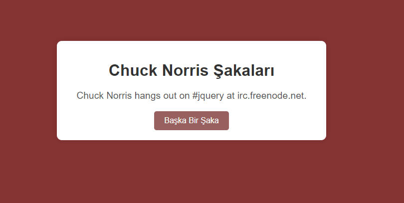

Chuck Norris Jokes
Project Description
The Chuck Norris Jokes project is a simple web application that fetches and displays random Chuck Norris jokes using the Chuck Norris API. This project is built using HTML, CSS, and JavaScript.


## Features
<ul>
<li>Fetch Random Jokes: Users can get random Chuck Norris jokes by clicking a button.</li>
<li>Responsive Design: Optimized for both mobile and desktop views.</li>
</ul>

## Technologies
<ul>
<li>HTML: Provides the structure of the application.</li>
<li>CSS: Used for styling and layout.</li>
<li>JavaScript: Adds interactivity and handles API requests.</li></ul>
  
## Installation
1.Clone the Repository:
```<language>
git clone https://github.com/ebruakcn/Patika.dev.git
```
2.Open the Project Files:<br>
Navigate to the Chuck Norris directory and open the index.html file in a web browser.

## Usage
<p>Once the project is set up, you can fetch random Chuck Norris jokes by clicking the "Get Joke" button. The application will display a new joke each time the button is clicked. You can customize the appearance and functionality by modifying the index.html, styles.css, and script.js files.</p>
