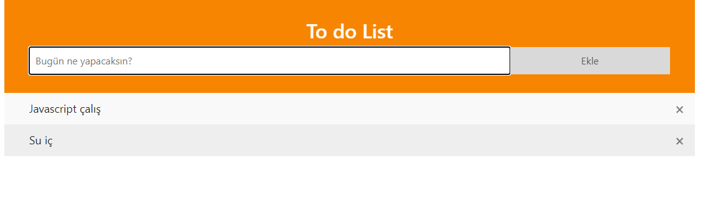
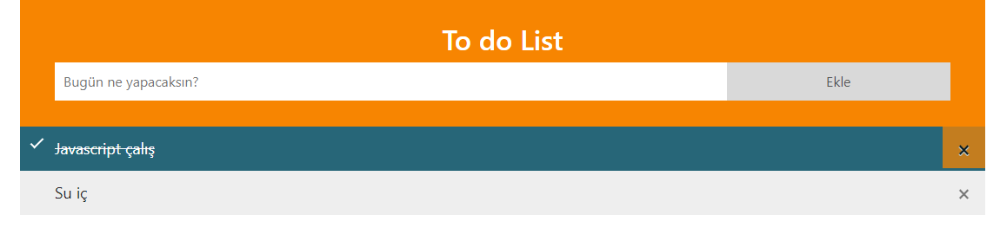

# Todolist
## Project Description
<p>Todolist is a simple and interactive task management application built using HTML, CSS, and JavaScript. This project allows users to add, remove, and mark tasks as complete.</p>




## Features
<ul>
<li>Add Tasks: Users can add new tasks to the list.</li>
<li>Remove Tasks: Users can delete tasks from the list.</li>
<li>Mark as Complete: Users can mark tasks as completed.</li>
<li>Responsive Design: Optimized for both mobile and desktop views.</li>

## Technologies
HTML: Provides the structure of the application.
CSS: Used for styling and layout.
JavaScript: Adds interactivity to the application.
</ul>

## Installation
1.Clone the Repository:
```<language>
git clone https://github.com/ebruakcn/Patika.dev.git
```
2.Open the Project Files:<br>
Navigate to the Todolist directory and open the index.html file in a web browser.

## Usage
After setting up the project, you can start adding, removing, and marking tasks as complete. Modify the content in the index.html file and adjust styles in the styles.css file as needed. JavaScript functionality can be modified in the script.js file.
